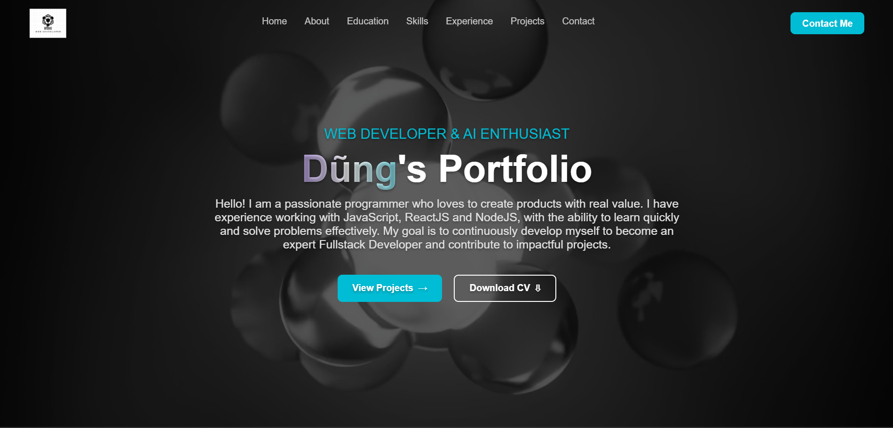

# 🎨 Personal Portfolio Website



## 🚀 Introduction

Welcome to my Personal Portfolio! This website is designed to showcase my technical skills, projects, and professional experience. It features a modern **Dark Theme**, fully responsive design, and smooth animations to provide an engaging user experience.

link demo: https://my-portfolio-xi-woad-15.vercel.app/

---

## ✨ Key Features

* **⚡ Modern UI/UX:** Clean dark mode aesthetic with Glassmorphism effects in the header.
* **📱 Fully Responsive:** Optimized layout for Desktop, Tablet, and Mobile devices.
* **✨ Smooth Animations:** Scroll-triggered animations, hover effects, and interactive elements.
* **📂 Project Showcase:** Detailed project cards with "Tech Stack" tags and links to GitHub/Live Demos.
* **🛠 Technical Skills:** Visual grid layout categorizing skills into Frontend, Backend, and Tools.
* **📧 Contact Form:** Functional contact form integrated with **EmailJS** (No backend required).
* **📍 Smart Navigation:** Sticky header that auto-hides on scroll down and reveals on scroll up.

---

## 🛠️ Tech Stack

This project was built using the following technologies:

| Category | Technologies |
| :--- | :--- |
| **Core** | [ReactJS](https://reactjs.org/) (Hooks, Functional Components) |
| **Routing** | [React Router DOM](https://reactrouter.com/) (v6) |
| **Styling** | CSS Modules, Flexbox, Grid, Responsive Design |
| **Icons** | [React Icons](https://react-icons.github.io/react-icons/) (FontAwesome 6, SimpleIcons) |
| **Logic/Utils** | EmailJS, React Hooks (useState, useEffect) |
| **Deployment** | [🔴 THAY ĐỔI Ở ĐÂY: Vercel / Netlify / GitHub Pages] |

---

## ⚙️ Installation & Setup

Follow these steps to run the project locally on your machine.

### 1. Clone the repository
```bash
git clone [https://github.com/DungStudyCode/My_Portfolio]
cd [portfilio]
2. Install dependencies
Make sure you have Node.js installed.

Bash

npm install
# or
yarn install
3. Configure EmailJS (Optional)
To make the Contact Form work, create a .env file or update Contact.js with your credentials:

Create an account at EmailJS

Get your Service ID, Template ID, and Public Key.

4. Run the development server
Bash

npm start
# or
yarn start
The app will open automatically at http://localhost:3000.

📂 Project Structure
Bash

src/
├── assets/          # Images (Logos, Project Screenshots)
├── components/      # Reusable components (Header, Footer, Buttons)
├── pages/           # Main Page Sections
│   ├── Home/        # Hero Section
│   ├── About/       # About Me
│   ├── Skills/      # Technical Skills Grid
│   ├── Projects/    # Project Showcase
│   ├── Experience/  # Work/Internship Timeline
│   └── Contact/     # Contact Form
├── App.js           # Main Entry Point & Routing
└── index.css        # Global Styles (Variables, Resets)

👤 Author
[🔴 Nguyễn Tiến Dũng]

🌐 Website: [🔴 https://my-portfolio-xi-woad-15.vercel.app/]

🐱 GitHub: [@username](https://github.com/DungStudyCode])

💼 LinkedIn: [https://www.linkedin.com/in/dung-nguyen-tien-77aba1358/)

📝 License
This project is licensed under the MIT License - see the LICENSE file for details.
